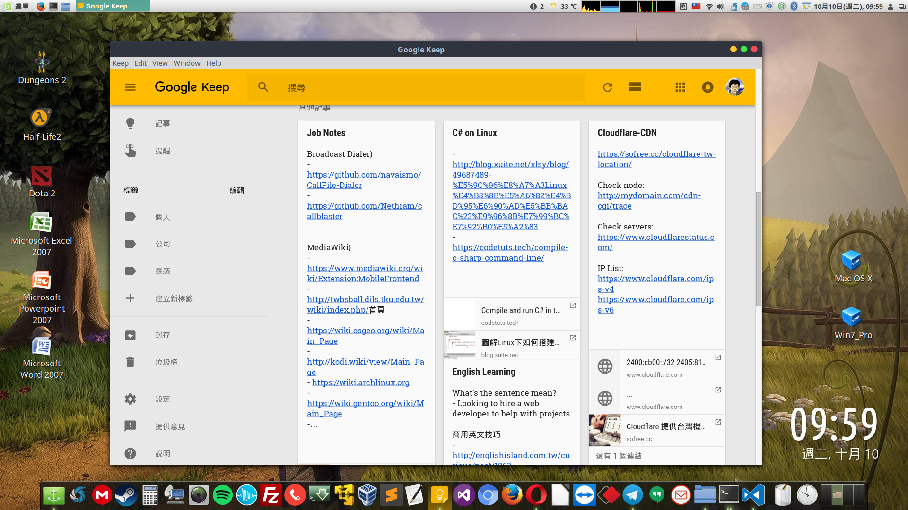
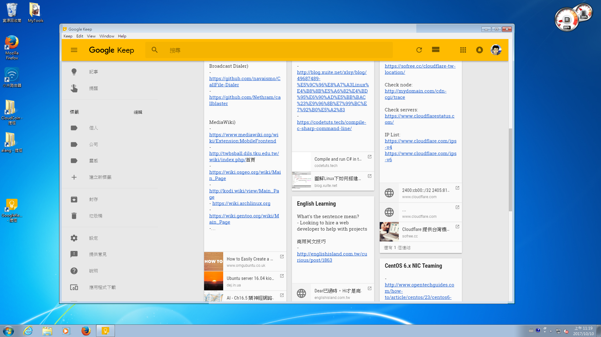
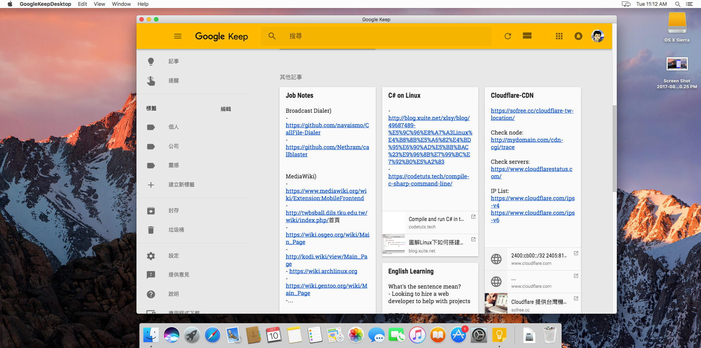

# GoogleKeepDesktop 

Desktop app for [Google Keep][google-keep] packaged with [Electron][electron]


Linux


Windows


Mac


## Install

The softwares are portable, just unpack the zip file then run it. 

Go to [Release][release] to download the packages for all OS.

* Linux: 
  * GoogleKeep-0.2.0-i386.AppImage (32-bit)
  * GoogleKeep-0.2.0-ia32.tar.gz (32-bit)
  * GoogleKeep-0.2.0-x86_64.AppImage (64-bit)
  * GoogleKeep-0.2.0-x86_64.tar.gz
* Mac: 
  * GoogleKeep-0.2.0-mac.zip (64-bit)
  * GoogleKeep-0.2.0-mac.tar.gz (64-bit)
* Windows: 
  * GoogleKeep-0.2.0-win.zip (64-bit)
  * GoogleKeep-Setup-0.2.0.exe (64-bit)


## Optional: Create Electron Development

```sh
git clone https://github.com/a-lang/keep.git
cd keep
npm install
```

## Optional: Build the distribution files

Build the application for specified platform:

```sh
npm start
npm run dist:linux64
npm run dist:macos
npm run dist:win
```

## License
Active Record is released under the [MIT license][license]

[google-keep]: https://keep.google.com
[electron]: http://electron.atom.io
[license]: https://opensource.org/licenses/MIT
[release]: https://github.com/a-lang/keep/releases